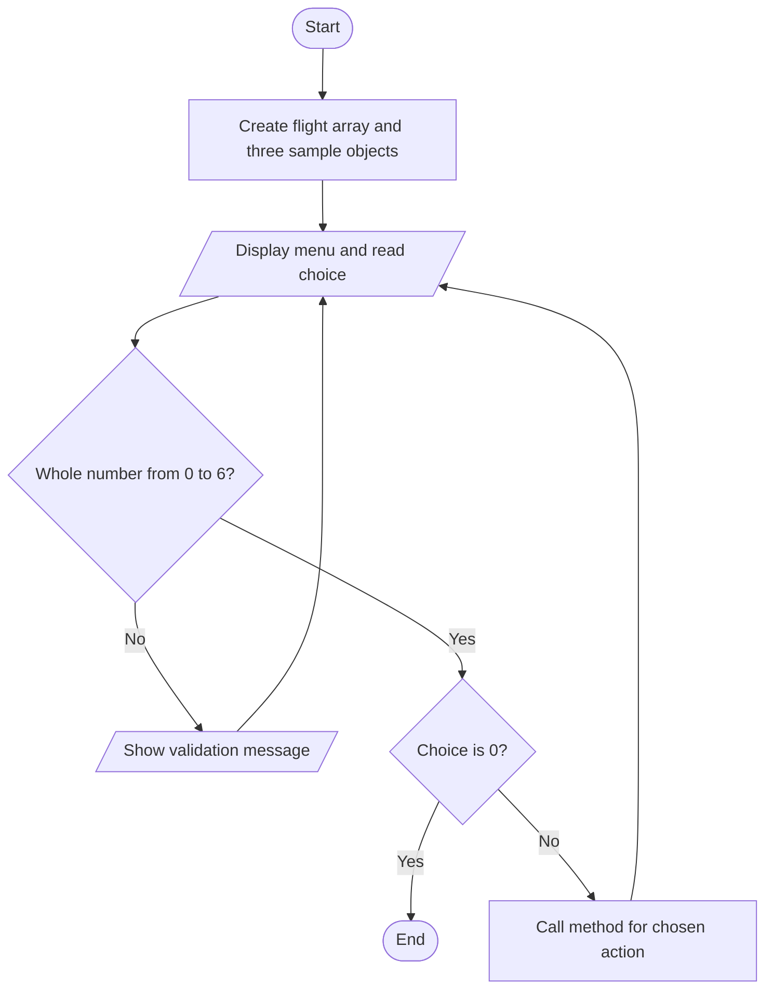
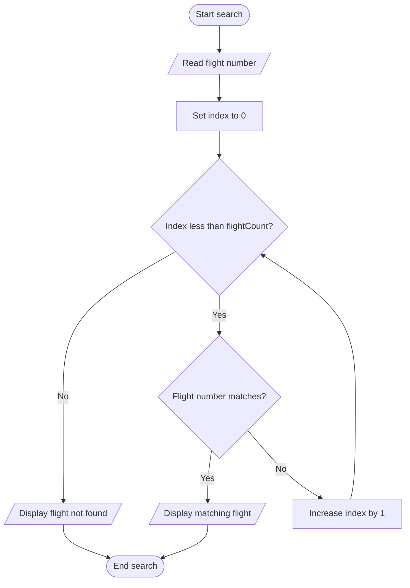

# 05. Flowcharts

A flowchart describes an algorithm before coding. Oval = start/end; rectangle = action; diamond = decision; parallelogram = input/output. This topic is a design document, not a Java program.

## Complete scheduler

## Search using an array

Text version: Start → read number → inspect each occupied array position → display the matching flight, or display “not found” after the final occupied position → end.
