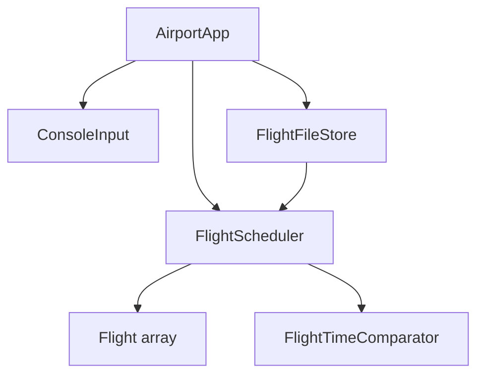
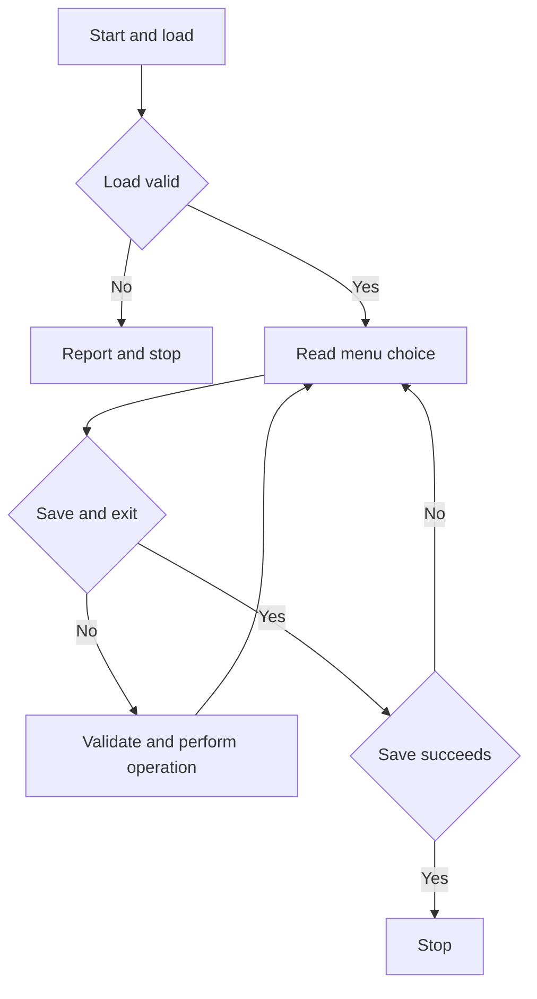

# Airport Flight Board and Scheduler Project Explanation

## Problem and objective

An operator needs to maintain a small departure board without manually reordering records after each delay. The operator must also avoid assigning active flights to the same gate too close together. This project represents each flight as an object and checks every proposed change before accepting it.

The goal is to demonstrate necessary introductory Java concepts through a usable console application. It is a scheduler in the limited sense of recording times and validating gate separation. It does not automatically find an optimal timetable or assign gates for the operator.

## Inputs and outputs

Inputs are a menu choice, flight details, a scheduled time, a gate, a total delay and a status. Outputs are a sorted departure board, matching flight details, validation messages, a flight summary and a persistent text file.

Each flight contains eight stored fields: number, airline, origin, destination, scheduled minutes, expected minutes, gate and status. Delay is computed as `expectedMinutes - scheduledMinutes`; it is not separately stored, which avoids inconsistent values.

## Design

The application has six classes. The console class collects input, the flight class validates individual records, the scheduler checks relationships between records, and the file class handles storage. A comparator supplies ordering to the Java library.



The scheduler owns a `Flight[]` with capacity 200 and a count of occupied positions. Only positions `0` through `count - 1` are searched. A copied array containing those records is sorted for display. Sorting the copy preserves the storage array's element order; the flight objects themselves are shared references, not deep copies.

`Flight` has private fields. The identity and scheduled details do not change after construction. Expected time, gate and status can change through a package-level mutator used by the scheduler. The normal application path always uses scheduler operations first, so cross-record gate checks happen before mutation. This is encapsulation for the trusted application classes, not a security boundary against arbitrary code placed in the same package.

## Main program algorithm

1. Select the default data file or a path supplied as one command-line argument.
2. Load and validate all records. If any record is malformed, report its line and stop without changing the source file.
3. Print the menu and read a valid integer choice.
4. Call the method for the chosen operation.
5. Catch invalid-operation exceptions, print the reason, and return to the menu.
6. Repeat until the operator saves and exits. If saving fails during normal exit, remain in the menu so the operator can retry.



## Add flight algorithm

1. Read a flight number, airline, origin, destination, scheduled time and gate.
2. Construct a `Flight` with expected time equal to scheduled time and status `SCHEDULED`.
3. Validate the text, route, time, gate and status inside the constructor.
4. Reject the record if the board has 200 flights or its number already exists.
5. Compare it with existing active flights at the same gate.
6. If no clash exists, place it at `flights[count]` and increment `count`.

## Gate clash algorithm

For each stored flight, skip departed/cancelled records and skip the record being updated. Calculate:

```text
difference = proposedExpectedMinutes - otherExpectedMinutes
clash = sameGate AND difference > -30 AND difference < 30
```

The two comparisons represent an absolute difference below 30 without needing an additional mathematical function. For 09:00 and 09:29, the gap is 29 and a clash exists. For 09:00 and 09:30, the gap is 30 and both records are accepted.

This simple rule treats a gate as requiring a minimum separation between expected departure times. It does not model an aircraft's full arrival-to-departure gate occupancy interval, aircraft type, boarding duration, towing or terminal compatibility.

## Delay update algorithm

1. Find the requested flight by linear search.
2. Reject changes to departed/cancelled flights.
3. Reject a negative delay or a delay that would cross midnight.
4. Calculate `proposedExpected = scheduledMinutes + totalDelay`.
5. Select `SCHEDULED` for zero delay or `DELAYED` for a positive delay.
6. Check the proposed gate/time/status against the other flights.
7. Update the record only after the check succeeds.

For the sample flight `6E101`, adding a total delay of 30 minutes changes its proposed time from 09:00 to 09:30. `AI202` already uses A1 at 09:45, so the 15-minute separation is rejected. A total delay of 10 minutes gives 09:10 and a 35-minute separation, so it succeeds.

## File algorithm

Loading uses a buffered reader and `split("\\|", -1)`. The pipe is escaped because `split` accepts a regular expression. The `-1` preserves empty trailing fields so validation can detect an empty final status. Every line must have eight fields and must pass both flight validation and scheduler validation.

Saving writes the exact header followed by one record per flight, using `String.join`. A temporary file in the destination directory receives the full new snapshot. The writer closes before replacement. A `finally` block attempts to remove a leftover temporary file, and try-with-resources closes readers/writers even when an exception occurs.

The program rewrites the snapshot rather than appending updates. Appending an updated flight would otherwise produce duplicate records and require an event-log or latest-record resolution scheme.

## Complexity

| Operation | Time | Reason |
|---|---|---|
| Find by flight number | O(n) | Linear scan of occupied positions |
| Add flight | O(n) | Duplicate search and gate scan |
| Delay, gate or status change | O(n) | Search and gate scan |
| Sort board | O(n log n) | Library object-array sort |
| Summary | O(n log n) in this implementation | Uses the sorted snapshot, then a single O(n) count/sum pass |
| Load n records | O(n squared) | Each addition checks earlier records |
| Save | O(n log n) | Sort snapshot, then write n records |
| Storage | O(MAX_FLIGHTS + n) references | Fixed backing array and an occupied-position snapshot |

Here `n` is the number of flights, at most 200. The bound makes straightforward scans reasonable and keeps the project easy to explain. A future larger system could use indexed lookup and a different gate data structure.

## Scope and future work

The delivered program is offline, single-user and single-day. It has no login, booking/payment feature, GUI, external database, live API, automatic schedule optimization or runway allocation. It saves on explicit save/normal exit; a forced termination can lose unsaved edits. Two simultaneous instances can overwrite one another's saved snapshot.

Possible extensions are dated records, actual gate occupancy intervals, a database for concurrent users, and an optional GUI. They are extensions, not features claimed for this version. The present design selects syllabus topics because they solve the current problem, not to demonstrate every language feature.
